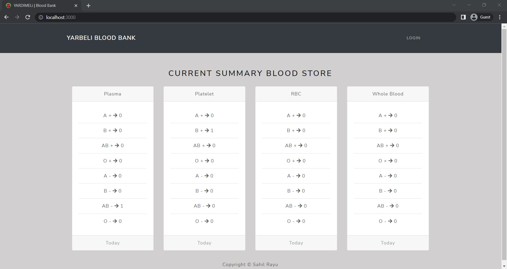
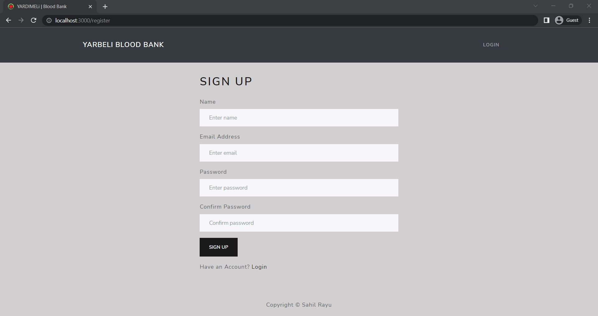
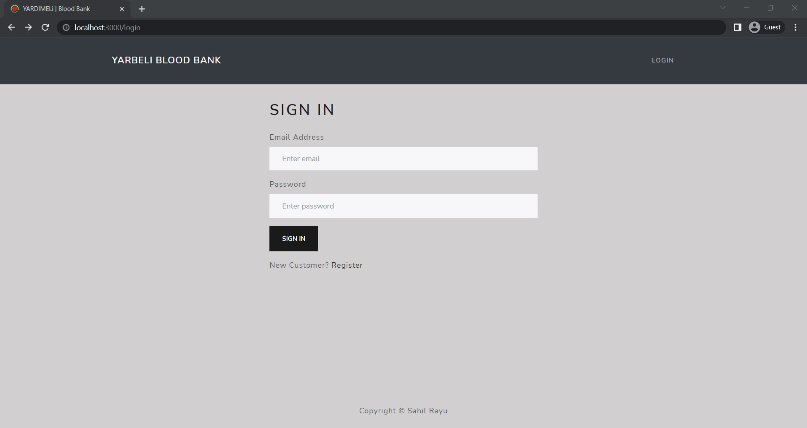
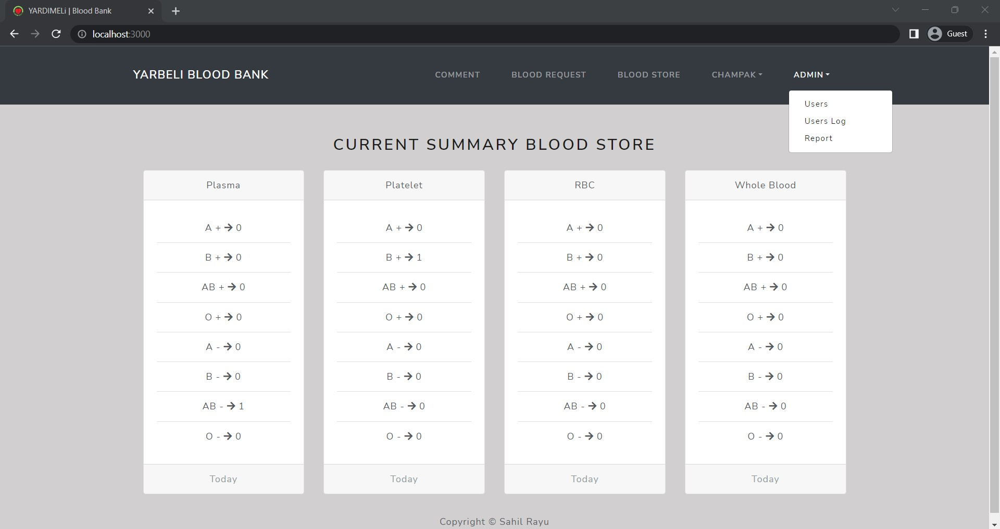
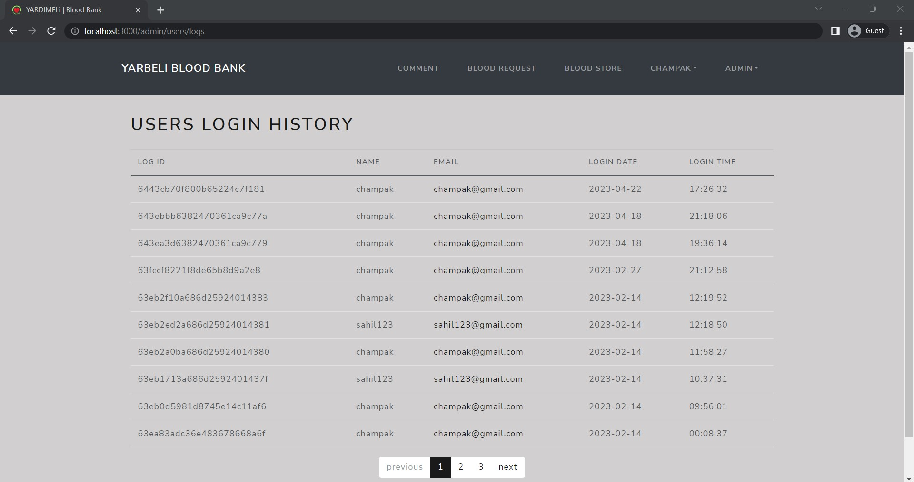
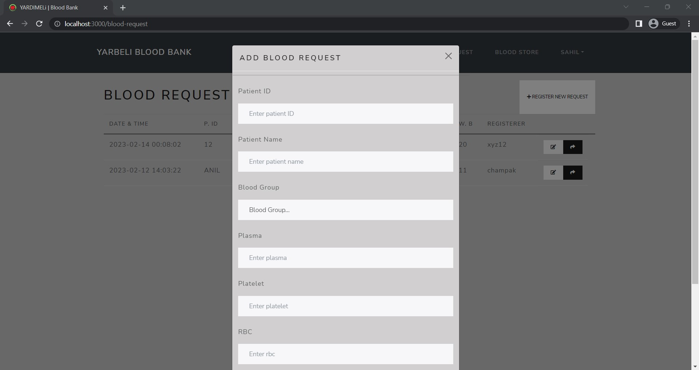

# End-Term-Project
This is an online blood bank project built using the MERN stack, which includes MongoDB, Express.js, React.js, and Node.js. The project aims to connect blood donors and recipients in a simple and easy way.

## Project Overview
The online blood bank is a web-based application that allows users to register themselves as donors or recipients. Donors can view the list of requests for blood and can donate if they meet the requirements. Recipients can request blood by submitting a request form. The admin can manage all users and requests.

## Features
- User registration and login functionality
- Donors can donate blood
- Recipients can request blood
- Admin dashboard to manage users and requests
- Email notification for donors and recipients
## 🛠 Tech Stack Used
- MongoDB: A NoSQL database used to store user and request data.
- Express.js: A Node.js web application framework used to build the server-side of the application.
- React.js: A JavaScript library used to build the user interface of the application.
- Node.js: A JavaScript runtime used to run the server-side of the application.
- Redux: A predictable state container used to manage application state.
- Bootstrap: A front-end framework used to style the application.

## Installation and Setup
- Clone the repository
- Install dependencies in the server and client folders using npm install
- In the server folder, create a .env file and add your MongoDB connection string and a secret key for JWT authentication
- Start the server using npm start command in the server folder
- Start the client using npm start command in the client folder
- Open your browser and navigate to `http://localhost:3000/`

## Screenshots

### Home page

### Register page

### Sign In page

### Admin page

### User Log

## Blood Request Page

